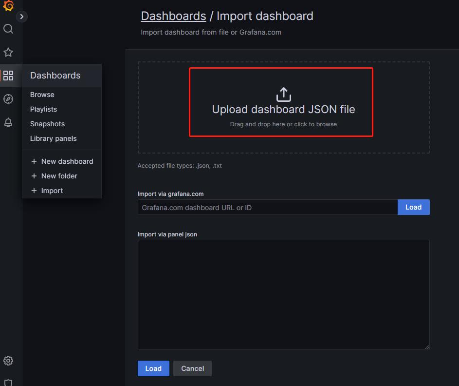
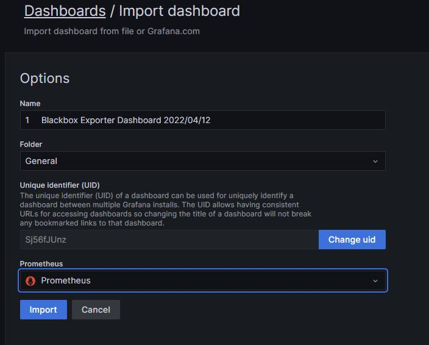
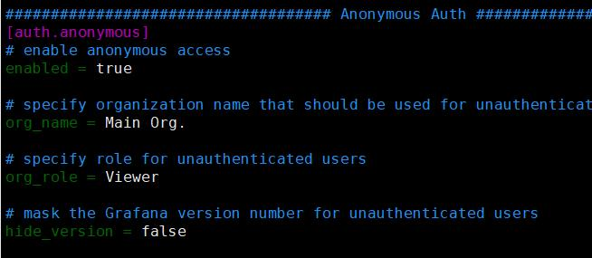

# 前置安装
<kbd>本次使用版本</kbd>  
`alertmanager-0.25.0.linux-amd64`  
`prometheus-2.43.0.linux-amd64`  
`blackbox_exporter-0.23.0.linux-amd64`  
`grafana-enterprise-9.4.7.linux-amd64`   
`jdk-8u371`

下载地址<https://prometheus.io/download/>

```bash
tar zxf prometheus-2.43.0.linux-amd64.tar.gz 
tar zxf alertmanager-0.25.0.linux-amd64.tar.gz 
tar zxf blackbox_exporter-0.23.0.linux-amd64.tar.gz 
tar zxf grafana-enterprise-9.4.7.linux-amd64.tar.gz
tar zxf jdk-8u371-linux-x64.tar.gz
mv prometheus-2.43.0.linux-amd64/ prometheus
mv grafana-9.4.7/ grafana
mv alertmanager-0.25.0.linux-amd64/ alertmanager
mv blackbox_exporter-0.23.0.linux-amd64/ blackbox_exporter

```

### Prometheus 配置开机启动

```bash
ln -s /root/prometheus /usr/local/prometheus
vim /usr/lib/systemd/system/prometheus.service
[Unit]
Description=Prometheus Monitoring System
Documentation=Prometheus Monitoring System
[Service]
ExecStart=/usr/local/prometheus/prometheus \
--config.file=/root/config/prometheus.yml \
--web.listen-address=:9090 \
--storage.tsdb.path=/data/prometheus \
--storage.tsdb.retention=30d
[Install]
WantedBy=multi-user.target

# 设置开机启动prometheus
systemctl daemon-reload
systemctl start prometheus
systemctl enable prometheus --now
```
### alertmanager 配置开机启动

```bash
ln -s /root/alertmanager /usr/local/alertmanager
vim /lib/systemd/system/alertmanager.service
[Unit]
Description=alertmanager
Documentation=https://github.com/prometheus/alertmanager
After=network.target
[Service]
Type=simple
User=root
ExecStart=/usr/local/alertmanager/alertmanager \
--config.file=/root/config/alertmanager.yml \
--storage.path=/data/alertmanager \
--web.listen-address=:9093 \
--data.retention=120h
Restart=on-failure
[Install]
WantedBy=multi-user.target

# 设置开机启动
systemctl daemon-reload
systemctl start alertmanager
systemctl enable alertmanager --now
systemctl status alertmanager
```

### blackbox 配置开机启动

```bash
ln -s /root/blackbox_exporter /usr/local/blackbox_exporter
vim /lib/systemd/system/blackbox_exporter.service
[Unit]
Description=blackbox_exporter
After=network.target
[Service]
User=root
Type=simple
ExecStart=/usr/local/blackbox_exporter/blackbox_exporter --config.file=/root/config/blackbox.yml
Restart=on-failure
[Install]
WantedBy=multi-user.target

# 设置开机启动
systemctl daemon-reload
systemctl start blackbox_exporter
systemctl enable blackbox_exporter --now
systemctl status blackbox_exporter
```

### grafana 配置开机启动

```bash
ln -s /root/grafana /usr/local/grafana
vim /lib/systemd/system/grafana.service
[Unit]
Description=Grafana
After=network.target
[Service]
Type=notify
ExecStart=/usr/local/grafana/bin/grafana-server -homepath /usr/local/grafana
Restart=on-failure
[Install]
WantedBy=multi-user.target

# 设置开机启动
systemctl daemon-reload
systemctl start grafana
systemctl enabled grafana --now
systemctl status grafana
```
**导入blackbox dashboard**

	

	

	

**可选：grafana开启免登录匿名访问 **

`vim grafana/config/default.ini` enabled改为true 即可实现免登录

	

# 告警推送配置

### 方式1：docker运行企业机器人webhook

```bash
# 安装docker依赖
yum install yum-utils -y
# 添加docker源
yum-config-manager --add-repo https://mirrors.aliyun.com/docker-ce/linux/centos/docker-ce.repo
# 安装docker如果使用docker运行webhook机器人 可以忽略jdk安装
yum install docker-ce-20.10.* docker-ce-cli-20.10.* -y
# 开启docker 
systemctl start docker && systemctl enabled docker --now
# 拉取封装好的wechatwebhook
docker pull registry.cn-shanghai.aliyuncs.com/rushbi/wechatwebhook
# docker方式监听 -p 9000:9000 url=【企业机器人地址】 9000是宿主机端口 xxxx替换为企业机器人地址
docker run --name webhook -d -p 9001:9000 -e url=xxxx registry.cn-shanghai.aliyuncs.com/rushbi/wechatwebhook
```

### 可选： 构建自己的docker 镜像

<kbd>Dockerfile</kbd>

```dockerfile
FROM openjdk:8-jre-alpine
MAINTAINER dawn.chuang
COPY webhook-0.0.2-SNAPSHOT.jar app.jar
ENTRYPOINT ["sh","-c","java -jar app.jar ${url}"]
```

```bash
docker build -t wechatwebhook .
```

### 方式2：宿主机运行企业机器人webhook JAR包方式

```bash
# 
tar zxf jdk-8u371-linux-x64.tar.gz
mv jdk1.8.0_371/ /usr/local/
source /etc/profile
java -version

# 添加jdk环境变量 在profile最后一行新增
vim /etc/profile
export JAVA_HOME=/usr/local/jdk1.8.0_371
export PATH=$JAVA_HOME/bin:$PATH
export CLASSPATH=.:$JAVA_HOME/lib/dt.jar:$JAVA_HOME/lib/tools.jar

# 后台启动jar包 --url=【企业机器人地址】xxxx替换为企业机器人地址 --server.port=xxxx 可指定监听端口
nohup java -jar webhook-0.0.2-SNAPSHOT.jar --url=xxxx >>java.log 2>&1 &
```

> **Wechatwebhook** Java程序 **GitHub**：https://github.com/520333/wechatwebhook

### Prometheus rule规则

<kbd>**blackbox_rules.yml**</kbd>

```yaml
groups:
- name: blackbox-exporter # 组的名字，在这个文件中必须要唯一
  rules:
  - alert: 端口探活 # 告警的名字，在规则组中需要唯一
    expr: probe_success{}==0
    for: 1m # 超过多少时间才认为需要告警
    labels:
      severity: warning # 严重等级定义标签
    annotations:
      summary: "{{ $labels.name }}"
      description: "{{ $labels.port }}端口,连续2分钟响应超时"
```

### Prometheus 动态发现配置

支持`HTTP` `TCP` `SSH` `ICMP`等常用端口探测 配置文件如下

<kbd>http.yml</kbd><kbd>tcp.yml</kbd> <kbd>ssh.yml</kbd><kbd>icmp.yml</kbd>

```yaml
- targets:
  - xxx.xxx.xxx.xxx
  labels:
    name: xxxx有限公司
    instance_region: 华南-广州3
    group_region: 丰泽
```

### 企业微信告警设置

`通过api推送告警通知需要在企业微信后台添加可信IP和可信域名`

<kbd>**alertmanager.yml**</kbd>

```yaml
global:
  wechat_api_url: "https://qyapi.weixin.qq.com/cgi-bin/"
  wechat_api_corp_id: "xxxx" #企业ID
route:
  group_by: ['alertname','instance','port'] #按实例再细分
  group_wait: 10s # 组等待时长
  group_interval: 1m # 组间隔
  repeat_interval: 1m  # 重复间隔
  receiver: wechat-app-and-api
  routes:
  - match:
      alertname: '端口检测'
    receiver: wechat-app-and-api
receivers:
  - name: wechat-app-and-api
    webhook_configs:
    - url: 'http://localhost:9000/webhook' # 指定webhook地址 需要和启动的java监听端口一致
      send_resolved: true
    wechat_configs:
    - send_resolved: true
      to_party: 2 #部门
      to_user: '@all'
      agent_id: 1000003
      api_secret: "xxx" #应用secret
      message: '{{ template "wechat.default.message" . }}' #告警模板
      
inhibit_rules:
  - source_match:
      severity: 'critical'
    target_match:
      severity: 'warning'
    equal: ['alertname', 'dev', 'instance']
templates:
- "./wechat.tmpl"
```

> 所有配置文件可以通过github获取 https://github.com/520333/prom
