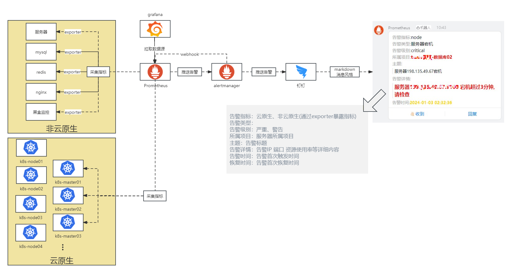
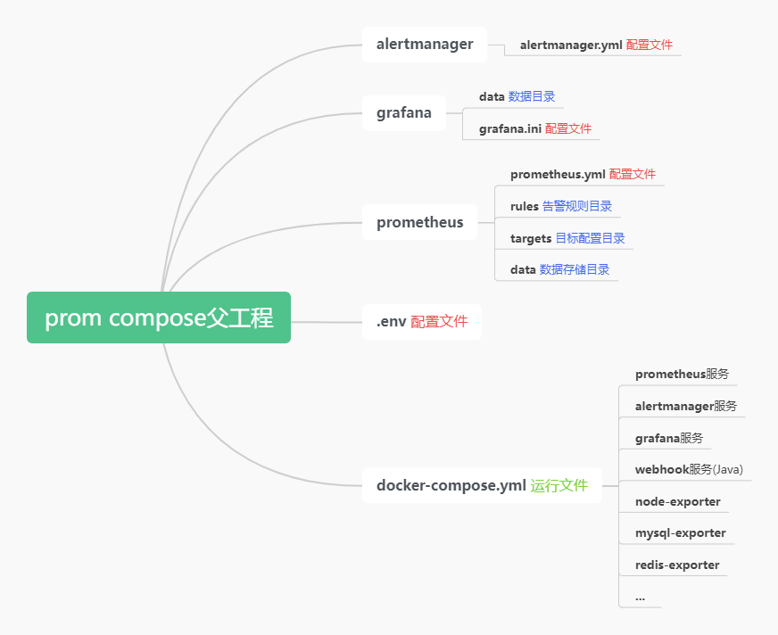

# Prometheus监控告警

## 一、项目架构



## 二、环境规划

### 主机规划

| 主机名称                |    IP地址    | 系统版本    | 内核版本               | CPU   | 内存 |
| ----------------------- | :----------: | ----------- | ---------------------- | ----- | ---- |
| prometheus | 192.168.50.191 | aliyun os 3 | 5.10.134-15.al8.x86_64 | 4Core | 8G   |

**运行环境：`docker/container`**

### A记录规划

| 域名                     | 服务                   |
| ------------------------ | ---------------------- |
| grafana.yourdomain.cn      | grafana数据可视化      |
| prometheus.yourdomain.cn   | prometheus指标采集     |
| alertmanager.yourdomain.cn | alertmanager告警中间件 |

### 应用规划

| 服务            | 版本   |
| --------------- | ------ |
| prometheus      | 2.44.0 |
| alertmanager    | 0.25.0 |
| grafana         | 9.4.7  |
| dingtalkwebhook | 1.1    |
| node-exporter   | 1.5.0  |

### 目录规划

| 名称         | 路径                                                   |
| ------------ | ------------------------------------------------------ |
| 所有软件目录 | /data/prom/                                            |
| 数据目录     | /data/prom/prometheus/data    /data/prom/grafana/data/ |


## 三、项目结构



## 四、项目配置文件

**启动命令:**

```bash
docker-compose up -d
docker compose up -d
```


### 1.docker-compose配置

```yaml
[root@metrics prom]# cat docker-compose.yml 
version: '3.7'
services:
  prometheus:
    #image: registry.cn-shanghai.aliyuncs.com/rushbi/prometheus:v2.44.0
    image: harbor.yourdomain.cn:1443/prom/prometheus:2.44.0
    container_name: prometheus
    working_dir: /etc/prometheus
    restart: always
    mem_limit: 500m
    volumes:
      - ./prometheus/:/etc/prometheus/
      - ./prometheus/data:/prometheus
    command:
      - --web.enable-lifecycle
      - --storage.tsdb.retention.time=30d
    network_mode: host
    logging:
      driver: "json-file"
      options:
        max-size: ${LOG_MAX_SIZE:-}

  grafana:
    #image: registry.cn-shanghai.aliyuncs.com/rushbi/grafana:9.4.7
    image: harbor.yourdomain.cn:1443/prom/grafana:9.4.7
    container_name: grafana
    environment:
      - GF_SECURITY_ADMIN_USER=${GF_SECURITY_ADMIN_USER:-}
      - GF_SECURITY_ADMIN_PASSWORD=${GF_SECURITY_ADMIN_PASSWORD:-}
    restart: always
    volumes:
      - /etc/localtime:/etc/localtime:ro
      - ./grafana/grafana.ini:/etc/grafana/grafana.ini:rw
      - ./grafana/data:/var/lib/grafana:rw
    mem_limit: 500m
    network_mode: host
    logging:
      driver: "json-file"
      options:
        max-size: ${LOG_MAX_SIZE:-}
    depends_on:
    - prometheus

  alertmanager:
    #image: registry.cn-shanghai.aliyuncs.com/rushbi/alertmanager:v0.25.0
    image: harbor.yourdomain.cn:1443/prom/alertmanager:0.25.0
    container_name: alertmanager
    working_dir: /etc/alertmanager
    restart: always
    mem_limit: 100m
    volumes:
      - ./alertmanager/alertmanager.yml:/etc/alertmanager/alertmanager.yml
    network_mode: host
    logging:
      driver: "json-file"
      options:
        max-size: ${LOG_MAX_SIZE:-}
    depends_on:
    - prometheus

  node-exporter:
    #image: registry.cn-shanghai.aliyuncs.com/rushbi/node-exporter:1.5.0
    image: harbor.yourdomain.cn:1443/prom/node-exporter:1.5.0
    container_name: node-exporter
    command:
      - '--path.rootfs=/host'
    network_mode: host
    pid: host
    restart: unless-stopped
    volumes:
      - '/:/host:ro,rslave'
    logging:
      driver: "json-file"
      options:
        max-size: ${LOG_MAX_SIZE:-}

  webhook:
    image: harbor.yourdomain.cn:1443/prom/dingtalkwebhook:1.0
    container_name: webhook
    restart: always
    mem_limit: 200m
    environment:
      - url=${DINGTALK_BOT_URL:-}
      - secret=${DINGTALK_BOT_SECRET:-}
      - atall=${DINGTALK_BOT_ATALL:-}
    network_mode: host
    logging:
      driver: "json-file"
      options:
        max-size: ${LOG_MAX_SIZE:-}
    depends_on:
    - alertmanager

  tengine:
    image: harbor.yourdomain.cn:1443/base/tengine-2.3.2-vts-0.2.1-alpine:1.0
    container_name: tengine
    restart: always
    network_mode: host
    volumes:
    - ./tengine/conf.d:/etc/nginx/conf.d
    - ./tengine/nginx.conf:/etc/nginx/nginx.conf
    - ./tengine/html:/etc/nginx/html
    - ./tengine/ssl:/etc/nginx/ssl
    - ./tengine/logs:/var/log/nginx
    logging:
      driver: "json-file"
      options:
        max-size: ${LOG_MAX_SIZE:-}
    depends_on:
    - prometheus
    - alertmanager
    - grafana
```

> prometheus/data 需要o+w权限
>
> grafana/data 需要g+w权限

### 2.env配置

```properties
[root@metrics prom]# cat .env
# 全局配置
#
# grafana账号
GF_SECURITY_ADMIN_USER=ysd
#
# grafana密码
GF_SECURITY_ADMIN_PASSWORD=ysd@2024
#
# 钉钉机器人webhook地址
DINGTALK_BOT_URL='https://oapi.dingtalk.com/robot/send?access_token=7d6610f0bf5c0133331f2d7578aa0b4605b988ac67e1194c33a16a4bb0b3d7f9'
#
# 钉钉机器人加签密钥
DINGTALK_BOT_SECRET='SEC47fdaf7703eb524fd5addb0ba2c97ea058fad75cb354c06a80f684eedeb6c0e2'
#
# 是否开启@所有人功能
DINGTALK_BOT_ATALL=false
#
# 容器日志最大存储空间
LOG_MAX_SIZE=400m
```

### 3.prometheus配置

```yaml
[root@metrics prom]# cat prometheus/prometheus.yml
global:
  scrape_interval: 15s 
  evaluation_interval: 15s
alerting:
  alertmanagers:
    - static_configs:
        - targets: 
          - localhost:9093
rule_files:
  - ./rules/*.yml
scrape_configs:
  - job_name: prometheus
    metrics_path: /metrics
    static_configs:
    - targets: ["localhost:9090"]

  - job_name: node
    metrics_path: /metrics
    file_sd_configs:
    - files:
      - ./targets/node.yml
      refresh_interval: 15s
    relabel_configs:
    - source_labels: [__address__]
      regex: '(.*):(\d+)'
      target_label: ip
      replacement: '${1}'

  - job_name: process
    metrics_path: /metrics
    file_sd_configs:
    - files:
      - ./targets/process.yml
      refresh_interval: 10s

  - job_name: nginx
    metrics_path: /monitor/format/prometheus
    file_sd_configs:
    - files:
      - ./targets/nginx.yml
      refresh_interval: 10s

  - job_name: mysql
    metrics_path: /metrics
    file_sd_configs:
    - files:
      - ./targets/mysql.yml
      refresh_interval: 10s
```

### 4.grafana配置

```yaml
[root@metrics prom]# grep "^[a-Z]" grafana/grafana.ini
domain = grafana.yourdomain.cn                        # 域名
serve_from_sub_path = true							# 通过ng反向代理需要加上
enabled = true                                      # 开启匿名访问grafana面板
```

### 5.alertmanager配置

```yaml
[root@metrics prom]# cat alertmanager/alertmanager.yml
global:
route:
  group_by: ['alertname']
  group_wait: 0s
  group_interval: 1m
  repeat_interval: 4h
  receiver: dingtalkbot
receivers:
  - name: dingtalkbot
    webhook_configs:
    - url: 'http://localhost:9000/webhook'
      send_resolved: true
inhibit_rules:
  - source_match:
      severity: 'critical'
    target_match:
      severity: 'warning'
    equal: ['alertname', 'dev', 'instance']
```

### 6.node_exporter配置

```yaml
[root@metrics prom]# cat prometheus/targets/node.yml
- targets: 
  - 192.168.100.50:9100
  labels:
    name: SP演示服
    eth1: 192.168.0.50
```

### 7.告警转发组件-Dockerfile

```dockerfile
[root@metrics prom]# cat Dockerfile
FROM openjdk:8-jre-alpine
MAINTAINER dawn.chuang
COPY webhook-0.0.2-SNAPSHOT.jar app.jar
ENTRYPOINT ["sh","-c","java -jar app.jar ${url} ${secret}"]
```


## 五、Nginx反向代理配置

### 1.配置用户登录认证

```shell
[root@metrics conf]# yum install -y httpd-tools
[root@metrics conf]# htpasswd -b -c /data/tengine/conf.d/auth ysd ysd@2024
```

### 2.grafana站点配置

```nginx
[root@metrics conf.d]# cat grafana.yourdomain.cn.conf
map $http_upgrade $connection_upgrade {
  default upgrade;
  '' close;
}
upstream grafana {
  server localhost:3000;
}

server {
  listen 80;
  server_name grafana.yourdomain.cn;

  location / {
    proxy_set_header Host $http_host;
    proxy_pass http://grafana;
  }

  location /api/live/ {
    proxy_http_version 1.1;
    proxy_set_header Upgrade $http_upgrade;
    proxy_set_header Connection $connection_upgrade;
    proxy_set_header Host $http_host;
    proxy_pass http://grafana;
  }
}
```

### 3.Prometheus站点配置

```nginx
[root@metrics conf.d]# cat prometheus.yourdomain.cn.conf
server{
	listen 80;
	server_name prometheus.yourdomain.cn;
	location / {
		auth_basic "yourdomain.cn";
		auth_basic_user_file conf.d/auth;
		proxy_pass http://localhost:9090;
		include conf.d/proxy_params;
	}
}
```

### 4.alertmanager站点配置

```nginx
[root@metrics conf.d]# cat alertmanager.yourdomain.cn.conf
server{
	listen 80;
	server_name alertmanager.yourdomain.cn;
	location / {
		auth_basic "yourdomain.cn";
		auth_basic_user_file conf.d/auth;
		proxy_pass http://localhost:9093;
		include conf.d/proxy_params;
	}
}
```
